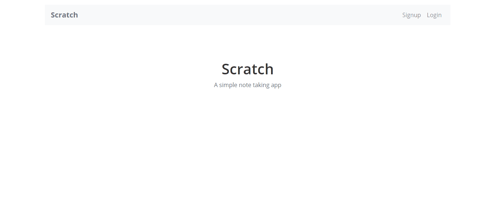

# Scratch

Scratch - An CRUD application where user can create, read, update and delete  the notes. Also, users can attach image related to a particular note.

## Table of Contents

-   [Contributors](#contributors)
-   [Technologies](#technologies)
-   [Features](#features)
-   [Usage](#usage)

---

## Contributors

-   [Gurkiran Singh](https://github.com/g4rry420)

## Technologies

-   JavaScript
-   React.js
-   Context API
-   AWS - S3, Amplify
-   Stripe Payment

## Features

-   User login/sign up secure authentication AWS Amplify and Cognito Identity Pool.
-   Authenticated User can create notes and also attach image related to notes.
-   Notes are stored securely in DynamoDb and images are stored in S3 bucket.

## Usage

-   `npm start` - To start with frontend of the project.
